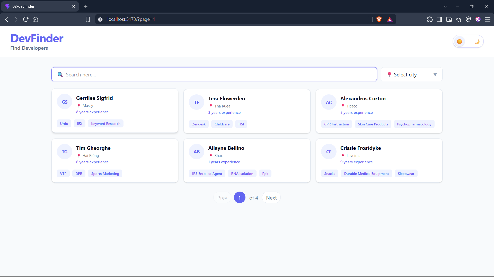
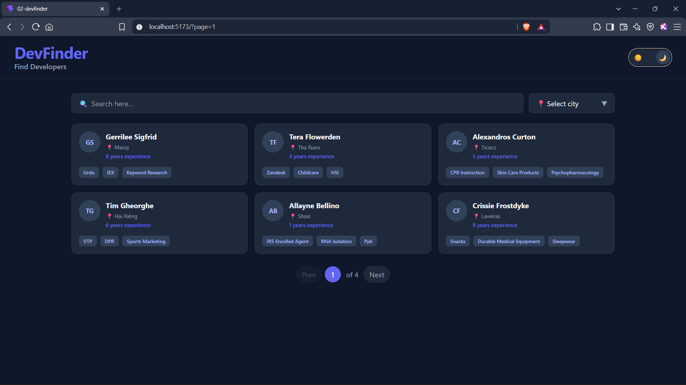
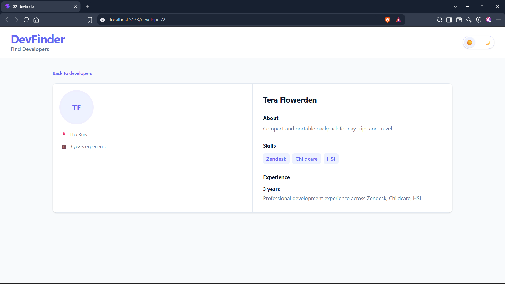
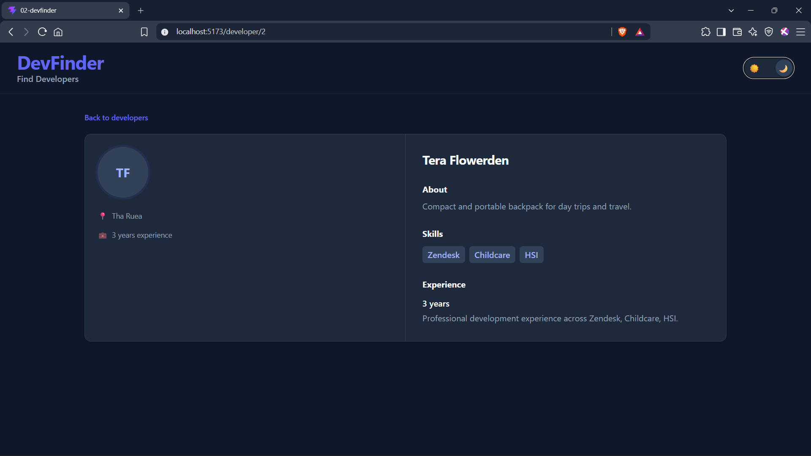

# DevFinder 🔎

A responsive developer directory built with **React** and **Tailwind CSS**.

DevFinder allows users to search for developers by name or skill, filter developers by city, browse paginated results, and view individual developer profiles. The application also supports light and dark themes with a responsive interface designed for different screen sizes.

## ✨ Features

- 🔍 Search developers by name or skill
- 📍 Filter developers by city
- ⏳ Debounced search for a smoother experience
- 📄 Client-side pagination
- 👤 Individual developer profile pages
- 🌙 Light and dark mode
- 📱 Responsive design
- 🔗 URL-based pagination using React Router
- 🚫 Custom "Developer not found" and "Page not found" states
- ⚡ Fast client-side filtering using local mock data
- 🎨 Custom Tailwind CSS theme and color system

---

## 📸 Screenshots

### Homepage — Light Mode



### Homepage — Dark Mode



### Developer Profile — Light Mode



### Developer Profile — Dark Mode



---

## 🛠️ Tech Stack

- **React** — UI development
- **React Router** — Routing, loaders, URL search parameters
- **Tailwind CSS** — Styling and responsive design
- **Vite** — Development environment and build tooling
- **JavaScript** — Application logic
- **JSON** — Mock developer data

---

## 📂 Project Structure

```text
src/
├── components/
│   ├── DeveloperCard.jsx
│   ├── DeveloperList.jsx
│   └── ThemeButton.jsx
│
├── context/
│   └── ThemeContextProvider.jsx
│
├── hooks/
│   └── useDebounce.jsx
│
├── pages/
│   ├── DeveloperPage.jsx
│   ├── ErrorPage.jsx
│   ├── HomePage.jsx
│   └── NotFound.jsx
│
├── router/
│   └── router.jsx
│
├── services/
│   └── MOCK_DATA.json
│
├── App.jsx
├── index.css
└── main.jsx
```

## 🚀 Getting Started

**Prerequisites**
Make sure you have the following installed:

- Node.js
- npm

**Installation**

- Clone the repository: `git clone <your-repository-url>`
- Navigate into the project: `cd devfinder`
- Install dependencies: `npm install`
- Start the development server: `npm run dev`
  The application will be available at the local URL provided by Vite.

# 🔎 Search & Filtering

The homepage provides two ways to find developers.
**Search**
Developers can be searched by:

- Developer name
- Skills

The search input uses a custom useDebounce hook to avoid filtering the dataset on every keystroke.

```
User types
    ↓
Debounce delay
    ↓
Search value updates
    ↓
Developer list is filtered
```

**City Filter**

The city dropdown is populated dynamically from the developer dataset.
Selecting a city filters the displayed developers to that location.

# 📄 Pagination

Developer results are displayed six at a time.

Pagination is handled through React Router's useSearchParams:

```
/?page=1
/?page=2
/?page=3
```

This means the current page is reflected in the URL and can be navigated without introducing separate pagination state.

When the search query or city filter changes, pagination is reset to the first page.

# 👤 Developer Profiles

Each developer has an individual profile page: `/developer/:devId`
The profile displays:

- Developer name
- Initials avatar
- City
- Years of experience
- Biography
- Skills
- Experience summary

Only the developer's **avatar** and **name** are clickable from the developer card, while the rest of the card remains non-clickable.

# 🌙 Theme System

DevFinder includes a custom light/dark theme system using:

- React Context
- React state
- Tailwind CSS dark mode

The theme is managed through ThemeContextProvider.
The application uses a custom Tailwind dark variant:
`@custom-variant dark (&:where(.dark, .dark *));`
The theme can be toggled using the theme switcher in the header.

🎨 Tailwind CSS

The project uses a custom Tailwind theme with application-specific colors.
Some of the custom design tokens include:

```
--color-backgroundLight
--color-backgroundDark

--color-cardLight
--color-cardDark

--color-primary
--color-primaryLight

--color-textPrimaryLight
--color-textSecondaryLight

--color-textPrimaryDark
--color-textSecondaryDark

--color-Success
```

This keeps the styling consistent across light and dark themes.

# 🧭 Routing

The application uses React Router for navigation.
**Routes**
| Route | Page | Description |
| ------------------- | ----------------- | ------------------------------------------ |
| `/` | Home | Developer search, filtering and pagination |
| `/developer/:devId` | Developer Profile | Individual developer details |
| `*` | Not Found | Handles invalid routes |

React Router loaders are used to retrieve:

- Available cities for the homepage
- Developer information for profile pages

# 🧩 Custom Hook

`useDebounce`
A reusable debounce hook is used to delay search updates:
`const debounceVal = useDebounce(query);`
The default delay is 500ms.
This keeps the search experience responsive while avoiding unnecessary filtering operations while the user is typing.

# 📊 Data

The project currently uses local mock data stored in: `src/services/MOCK_DATA.json`
Each developer contains information such as:

```
{
  "id": 1,
  "name": "Developer Name",
  "city": "City",
  "experience": 5,
  "bio": "Developer biography",
  "skills": [
    "React",
    "JavaScript",
    "Tailwind CSS"
  ]
}
```

No external backend or API is required to run the application.

# 📱 Responsive Design

The interface is designed to work across different screen sizes.
The developer grid adapts based on viewport width:

```
Mobile      → 1 column
Tablet      → 2 columns
Desktop     → 3 columns
```

Developer profile layouts also adapt between single-column and two-column layouts depending on screen size.

